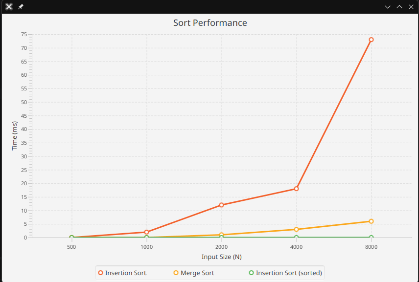

Steps to run the program on my laptop (Nobara). Base yourself on the step for it run on your laptop in case it is not. (It runs on my machine moment)

// Run comma
nd directly if compile version exist:
java --module-path /home/tks/Downloads/javafx-sdk-26.0.2/lib --add-modules javafx.controls main

//if file was modified, delete previous .class files and recompile
rm *.class //removing existing alrady compiled class

javac --module-path /home/tks/Downloads/javafx-sdk-26.0.2/lib --add-modules javafx.controls main.java

Proof it runs on my machine:

